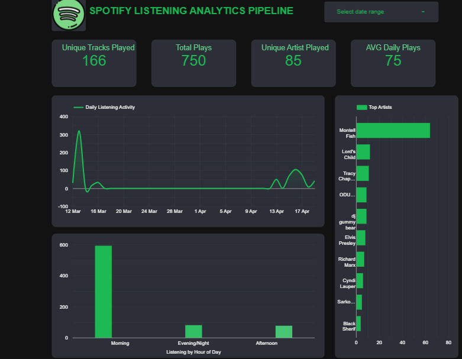

# Spotify Listening Analytics Pipeline (2026)

This project builds a production-style analytics pipeline for personal Spotify listening data. Each phase explains what is built and why it matters in real-world data engineering.

## Problem Description
Spotify's app gives lightweight listening summaries, but it does not provide a reliable analytics system for year-to-date tracking, trend analysis, and reproducible reporting.

This project solves the following concrete problem:
- Listening activity is generated continuously.
- Spotify API data can be missed over time if ingestion is not incremental.
- Manual analysis is slow, inconsistent, and difficult to refresh daily.

This pipeline fixes that by:
- Extracting recent listening events from Spotify API on a schedule.
- Storing immutable raw JSON in cloud storage for reprocessing and auditability.
- Loading data into BigQuery for scalable querying.
- Transforming data into analytics-ready star schema tables for dashboarding.

### Who this helps
- Primary user: the Spotify account owner who needs accurate year-to-date behavior analytics.
- Secondary audience: reviewers assessing end-to-end data engineering skills.

### Why this matters
- Without daily incremental ingestion, history quality degrades.
- Without orchestration, updates rely on manual runs.
- Without modeled warehouse tables, BI dashboards become harder to trust and maintain.

### Success criteria
- Pipeline runs automatically daily with no manual intervention.
- Raw and transformed layers are clearly separated.
- Dashboard queries always point to curated analytics tables and update after each successful run.

## Architecture (Logical Flow)
Spotify Web API
-> Ingestion service (Python)
-> Raw JSON in GCS (date-partitioned)
-> BigQuery raw layer
-> dbt transformations
-> Analytics star schema
-> Dashboard (Looker Studio)

## Cloud + IaC 
This project is deployed on Google Cloud Platform (GCP), and cloud resources are provisioned with Terraform.

### Cloud services used
- Google Cloud Storage (GCS): raw landing zone for immutable JSON ingestion files.
- BigQuery dataset `spotify_pipeline`: raw ingestion layer.
- BigQuery dataset `spotify_analytics`: transformed analytics layer used by dbt and BI.

### Infrastructure as Code (Terraform)
Terraform code is in `terraform/` and provisions cloud resources through:
- `terraform/main.tf`: GCS bucket + BigQuery datasets.
- `terraform/variables.tf`: parameterized cloud config.
- `terraform/outputs.tf`: exported created resource identifiers.
- `terraform/terraform.tfvars`: environment-specific values.

### Reproducible cloud provisioning
From repository root:
- `cd terraform`
- `terraform init`
- `terraform plan`
- `terraform apply`

This demonstrates that the project is not local-only: storage and warehouse layers run in GCP, and they are reproducibly created via IaC.

## Workflow Orchestration Evidence 
The pipeline is orchestrated end-to-end in Kestra using a single DAG defined in `kestra/spotify_pipeline_flow.yaml`.

### DAG structure
- `clone_repo`: pulls the latest project code.
- `extract`: calls Spotify API and writes incremental raw JSON.
- `upload_gcs`: uploads raw files to GCS data lake.
- `load_bq`: loads raw files from GCS into BigQuery raw table.
- `dbt_run`: runs dbt models and tests to produce analytics tables.

### Orchestration behavior
- Schedule trigger: runs daily using cron `0 6 * * *`.
- Manual trigger: can also be launched from Kestra UI for ad-hoc runs.
- Secret management: Spotify + GCP credentials are injected through Kestra secrets.

### Why this satisfies end-to-end orchestration
This is not partial orchestration. Ingestion, lake upload, warehouse load, and transformations are all executed in one workflow DAG with ordered task dependencies.

## Data Warehouse Optimization Evidence 
The analytics warehouse is optimized in BigQuery to match expected query patterns.

### Implemented optimization
In `dbt/spotify_analytics/models/marts/fact_listening.sql`:
- Partitioning: `played_at_ts` by day.
- Clustering: `track_id`, `artist_id`.

### Why this is the right design
- Most dashboard queries filter by time windows (day/week/month), so partition pruning reduces scanned data.
- Common aggregations by track and artist benefit from clustering, improving query performance and cost.
- The fact table keeps event grain, while dimensions remain compact lookup tables.

### Example upstream queries this supports efficiently
- "Top artists in the last 30 days"
- "Most played tracks this month"
- "Daily listening trend over time"
## Why This Architecture
- Separate raw storage from curated models to preserve source truth and allow reprocessing.
- Use a warehouse for fast analytics and governance.
- Use dbt for transparent, testable transformations.
- Orchestrate with Kestra to make the pipeline repeatable and reliable.

## Project Phases
- Phase 0: Repo structure + architecture 
- Phase 1: Ingestion foundation (OAuth + API extraction)
- Phase 2: Data lake + raw warehouse
- Phase 3: Incremental loading + deduplication
- Phase 4: dbt star schema + tests
- Phase 5: Orchestration + IaC (Kestra + Terraform)
- Phase 6: Visualization (Looker Studio dashboard)

## Constraints
- Spotify API provides limited history; daily ingestion builds history over time.
- Backfill is intentionally skipped for this project scope; focus is current-year analytics.

## Reproducibility Guide

This project is reproducible on a clean machine using the steps below.

### 1. Prerequisites
- Python 3.11+
- Docker Desktop
- Terraform 1.6+
- dbt-core + dbt-bigquery
- Google Cloud SDK (optional, for auth checks)
- A GCP project with billing enabled

### 2. Clone and install
```powershell
git clone https://github.com/<your-username>/<your-repo>.git
cd <your-repo>
python -m venv .venv
.\.venv\Scripts\Activate.ps1
pip install -r requirements.txt
pip install dbt-bigquery
```
## 3. Configure Environment Variables
```
Create `configs/.env` from `configs/.env.example` and fill:
- `SPOTIFY_CLIENT_ID`
- `SPOTIFY_CLIENT_SECRET`
- `SPOTIFY_REDIRECT_URI`
- `SPOTIFY_REFRESH_TOKEN`
- `GIT_REPO_URL`

Do not commit real secrets.
``` 

### 5. Provision Cloud Resources with Terraform
```powershell
cd terraform
terraform init
terraform plan
terraform apply
cd ..
```

### 6. Run Ingestion Locally (Manual Validation)
```powershell
python ingestion/extract_spotify_data.py
python ingestion/upload_to_gcs.py
python ingestion/load_to_bigquery.py
```

### 7. dbt run
Run dbt Transformations Locally
```powershell
dbt run --project-dir dbt/spotify_analytics --profiles-dir dbt
dbt test --project-dir dbt/spotify_analytics --profiles-dir dbt
```


### 8. Run Orchestration with Kestra (Docker)
```
1. Start Kestra locally with Docker.
2. Add Kestra secrets:
   - `SPOTIFY_CLIENT_ID`
   - `SPOTIFY_CLIENT_SECRET`
   - `SPOTIFY_REFRESH_TOKEN`
   - `SPOTIFY_REDIRECT_URI`
   - `GIT_REPO_URL`
   - `GCP_SA_KEY_JSON`
3. Create or update flow from `kestra/spotify_pipeline_flow.yaml`.
4. Run once manually to validate.
5. Keep cron trigger enabled for daily runs.
```

### 9. Verification Checks
```
After a successful run, verify:
- New files in GCS raw prefix
- New rows in `spotify_pipeline.listening_history_raw`
- dbt tables in `spotify_analytics`:
  - `fact_listening`
  - `dim_artist`
  - `dim_album`
  - `dim_track`
  - `dim_time`
```

### 10. Common Troubleshooting
```
- `profiles.yml not found`: run dbt with `--profiles-dir dbt`
- `GOOGLE_APPLICATION_CREDENTIALS not found`: check key path or secret injection
- BigQuery schema mismatch: align loader schema with existing table schema before append
- Kestra save error (`Flow must not be empty`): validate YAML indentation and namespace
```

## Dashboard (Looker Studio)

Live dashboard:  
[Spotify Listening Analytics Dashboard](https://datastudio.google.com/reporting/80785454-764c-48ab-839d-c35b602364a2)

### What it shows
- Total Plays
- Top artists for the selected period
- Average daily plays
- Unique tracks played
- Unique artists played
- Daily listening activity
- Listening by hour of day

### Screenshot

